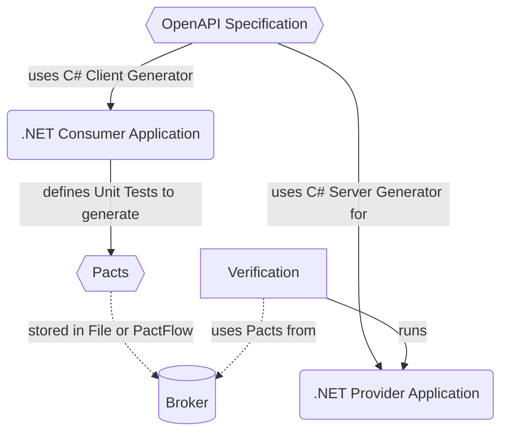

# Demo for integrating OpenAPI with Pact

This application demos the workflow of a simple [OpenAPI](https://spec.openapis.org/oas/v3.1.0) specification in combination with [Pact](https://pact.io/).

- Defining and specifying the [OpenAPI Description](./InterfaceDescription/openapi.yaml)
- Generating Consumer Stubs from the specification and defining the first `pacts` in [Consumer](Consumer/README.md)
- Generating Server Stubs, implementing the API and verifying the `pacts` in [Provider](Provider/README.md)




Besides storing and exchanging `pacts` via files an integration via <http://pactflow.io> is shown.

To integrate with PactFlow register an account and obtain a read/write Token and Host Configuration (e.g. from <https://trustbit.pactflow.io/settings/api-tokens>)

```bash
export PACT_BROKER_BASE_URL="https://trustbit.pactflow.io"
export PACT_BROKER_TOKEN=yourToken
```

